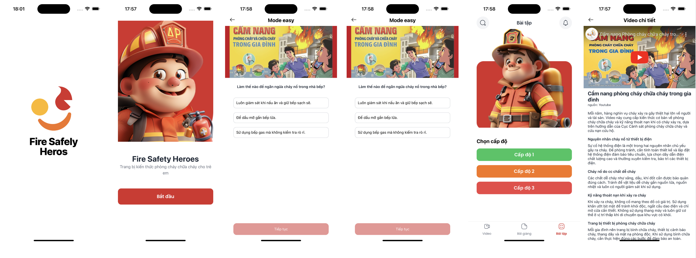

# Fire Prevention - Fire Safety Skills

## Description:
Fire Prevention is a mobile application designed to educate users on fire safety skills, ranging from basic to advanced levels. The app provides a comprehensive learning experience through instructional videos, detailed lessons, and interactive quizzes.

Fire Prevention works well on both iOS and Android devices.

**Main Features:**
- Users can watch monthly featured fire prevention instructional videos.
- Users can access lessons that include both video content and detailed written information.
- Practice exercises are available in the form of quizzes with three difficulty levels.

## Technologies Used:
* [React Native:](https://reactnative.dev/) A framework that supports building cross-platform mobile applications, ensuring a seamless experience on both iOS and Android devices.
* [Redux Toolkit:](https://redux-toolkit.js.org/) A library that efficiently manages the application’s state, allowing for easy scalability and maintenance of the app's complex state logic.
* [nativewind:](https://nativewind.dev/) A utility-first CSS framework for React Native, enabling rapid styling and design of the app's user interface.
* [expo-router:](https://expo.dev/router) A routing library for Expo applications that simplifies navigation and URL handling, making it easier to manage app screens and deep linking.
## Demo

# Demo
[(./)](./assets/images/screens/record.mp4)